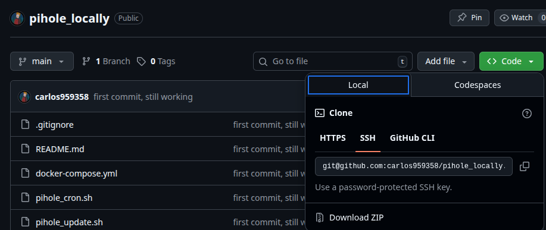

# Run Pihole locally on your Linux

---

The Pi-hole® is a [DNS sinkhole](https://en.wikipedia.org/wiki/DNS_Sinkhole) that protects your devices from unwanted content without installing any client-side software.

- **Easy-to-install**: our dialogs walk you through the simple installation process in less than ten minutes
- **Resolute**: content is blocked in _non-browser locations_, such as ad-laden mobile apps and smart TVs
- **Responsive**: seamlessly speeds up the feel of everyday browsing by caching DNS queries
- **Lightweight**: runs smoothly with [minimal hardware and software requirements](https://docs.pi-hole.net/main/prerequisites/)
- **Robust**: a command-line interface that is quality assured for interoperability
- **Insightful**: a beautiful responsive Web Interface dashboard to view and control your Pi-hole
- **Versatile**: can optionally function as a [DHCP server](https://discourse.pi-hole.net/t/how-do-i-use-pi-holes-built-in-dhcp-server-and-why-would-i-want-to/3026), ensuring _all_ your devices are protected automatically
- **Scalable**: [capable of handling hundreds of millions of queries](https://pi-hole.net/2017/05/24/how-much-traffic-can-pi-hole-handle/) when installed on server-grade hardware
- **Modern**: blocks ads over both IPv4 and IPv6
- **Free**: open source software that helps ensure _you_ are the sole person in control of your privacy

This project uses the 2025 Pihole image, which has a different configuration from previous years.

---

# Step 0: Preparation
## Install Docker to the latest version

[Get-started with Docker](https://www.docker.com/get-started/)

## Clone this repository and move inside the folder

---

# Step 1
## Configure DNS to always point to localhost
   1. Go to  `sudo nano /etc/systemd/resolved.conf`
   2. Change the option "#DNSStubListener=yes" to "DNSStubListener=no"
   3. Remove the file `resolv`: `sudo rm /etc/resolv.conf`
   4. Create symlink: `sudo ln -s /run/systemd/resolve/resolv.conf /etc/resolv.conf`
   5. Reload `systemd` service: `sudo systemctl restart systemd-resolved`

## Start Pihole container
   - Run `docker compose up -d` in the terminal

## Access Pihole Web Interface
   1. Go to your favorite web browser and search:
      - [127.0.0.1/admin/login](127.0.0.1/admin/login)
OR
      - [localhost/admin/login](localhost/admin/login)
   2. It should not require any password
      1. If you want to add a password go to `docker-compose.yml` and change the value of `FTLCONF_webserver_api_password` with your password 

---
# Step 2

Once installed and logged into the web browser, you will find something like this.

Now that the service is up you can add some domains to block.
On the left side you will find the options "Lists", once inside you could add lists to block or allow domains

You can find some blacklists here:
- [hagezi github](https://github.com/hagezi/dns-blocklists)
- [Firebog website](https://firebog.net/)
- [blocklistprojecthub](https://github.com/blocklistproject/Lists)

---

# Resources

By default, the container is limited to <ins>**2 cores**</ins> and <ins>**4 GB of memory**</ins>.

It is possible to change it going to the docker compose file and modifying the properties

- **cpus**
- **memory**

---

# About the updates

There is a folder whith a cron and bash update file that updates once a day the lists of blacklist/whitelist domains

------ 

For further information you can look at the [Official Pi-hole GitHub](https://github.com/pi-hole/docker-pi-hole) or the [Official Pi-hole Website](https://pi-hole.net/)